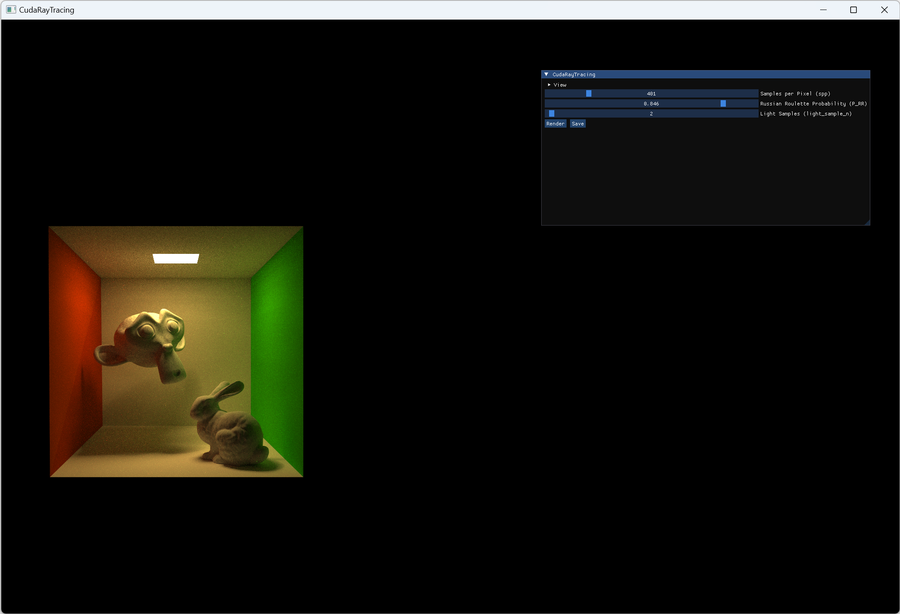
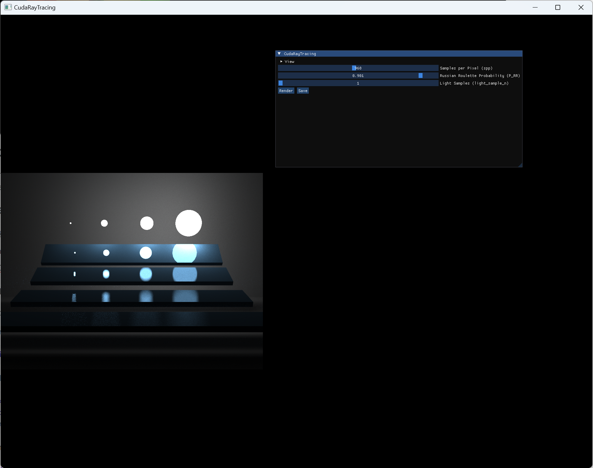

# CudaRayTracing
A simple ray-tracing program implemented with CUDA (no hardward ray tracing temporarily) .



## Getting Started

These instructions will provide you with a copy of the project running on your local machine for development and rendering. See the deployment section for notes on how to deploy the project in a live environment.

### Prerequisites

Before getting started, make sure you have the following requirements:
- Windows (temporarily)
- CUDA

### Installation & Run

Follow these steps to build the project locally:

1. Clone the repository: 

   ```shell
   git clone --recursive https://github.com/guomingce/CudaRayTracing.git
   ```

2. Build the program:

   ```shell
   mkdir build
   cd build
   cmake build ..
   ```

3. Run:

   ```shell
   cd ../
   ./build/Debug/CudaRayTracing.exe
   ```

4. Save: Press GUI Button `save`, rendered image will be saved in `/build/Debug/tmp` directory.

### Configure Rendering Task

You can configure your rendering task with the `./config.json` file, in which you can set arguments for ray-tracing rendering.

You can see examples below. 

You can set your `.obj` file path  and `.mtl` directory, then `eye_pos`, `lookat`, `up`, `fov_y` , `width`, `height`, `bvh_thresh_n`, `P_RR`, `spp` and `light_sample_n` denote the camera position, lookat position, up direction vector, vertical field of view, image width and height, and ray-tracing parameters including BVH nodes' triangles threshold, possibility Russian Roulette, sample per pixel,  and number of light samples. 

#### cornell-box 


 ```json
 {
     "OBJ_paths": [
         {
             "OBJ_path": "../../scenes/cornell-box/cornell-box.obj",
             "MTL_dir": "../../scenes/cornell-box/"
         }
     ],
 	"lookat": {
         "x":278.0, 
         "y":273.0, 
         "z":-799.0
     }, 
 	"up": {
         "x":0.0, 
         "y":1.0, 
         "z":0.0
     }, 
     "eye_pos": {
         "x": 278.0, 
         "y": 273.0, 
         "z":-800.0
     },
     "fov_y": 39.3077, 
     "width": 800,
     "height": 600,
     "bvh_thresh_n": 2,
     "P_RR": 0.6,
     "spp": 2,
     "light_sample_n": 2
 }
 ```

#### veach-mis 



```json
{
    "OBJ_paths": [
        {
            "OBJ_path": "../../scenes/veach-mis/veach-mis.obj",
            "MTL_dir": "../../scenes/veach-mis/"
        }
    ],

	"lookat": {
        "x": 0.0, 
        "y": 2.8, 
        "z": 0.0
    }, 
	"up": {
        "x":0.0, 
        "y":1.0, 
        "z":0.0
    }, 
    "eye_pos": {
        "x": 28.2792, 
        "y": 5.2, 
        "z": 1.23612e-06
    },
    "fov_y": 30.1143, 
    "width": 800, 
    "height": 600, 
    "bvh_thresh_n": 2, 
    "P_RR": 0.6, 
    "spp": 4, 
    "light_sample_n": 1
}
```

