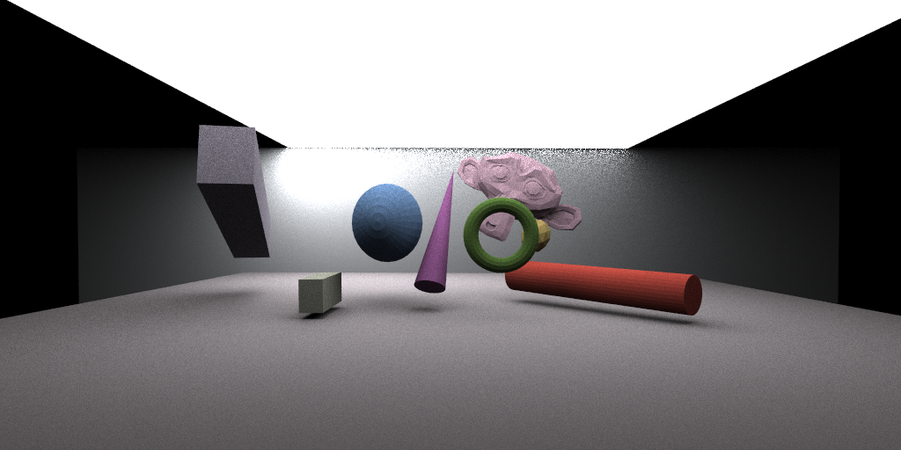
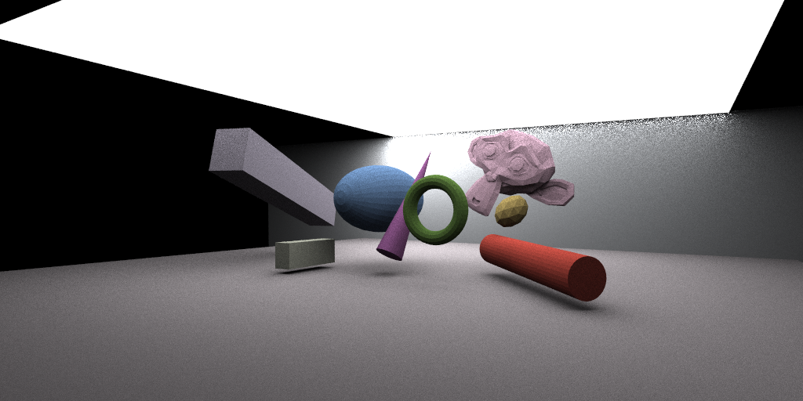
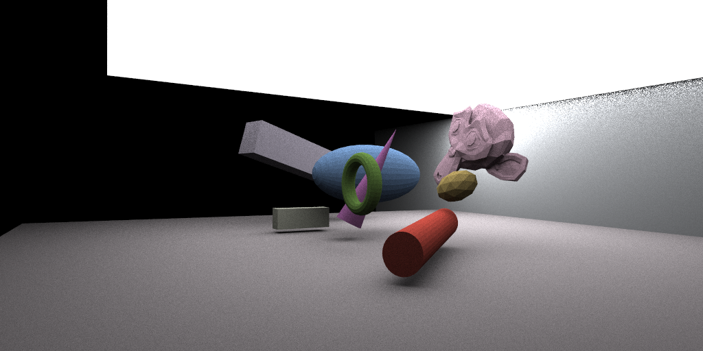

# CudaRayTracing
A simple ray-tracing program implemented with CUDA, which supports rendering images and videos.


## Getting Started

These instructions will provide you with a copy of the project running on your local machine for development and rendering. See the deployment section for notes on how to deploy the project in a live environment.

### Prerequisites

Before getting started, make sure you have the following requirements:

- OpenCV(4.x or above). For Windows machines, you should build OpenCV with MSVC in DEBUG mode to get `opencv_world*d.lib` and `opencv_videoio*d.lib` with the option `BUILD_opencv_world` on and off. For Unix-like environments, you can build OpenCV using the regular steps.
-  CUDA

### Installation

Follow these steps to build the project locally:

1. Clone the repository: 

   ```shell
   git clone https://github.com/guomingce/CudaRayTracing.git
   ```

2. Build the program:

   ```shell
   mkdir build
   cd build
   cmake build ..
   ```

### Configure Rendering Task

You can configure your rendering task with the `./config.json` file, in which you can set arguments for ray-tracing rendering.

You can see examples below. 

For `task-1`, it is a image rendering task, you can set your `.obj` file path  and `.mtl` directory, as for the loader implemented with [tiny_obj_loader](https://github.com/tinyobjloader/tinyobjloader), then `eye_pos`, `fovY` , `width`, `height` denote the camera position, vertical field of view, image width and height, and ray-tracing parameters including BVH nodes' triangles threshold, possibility Russian Roulette, sample per pixel,  and number of light samples. 

For `task-2`, it is a video rendering task, in addition to the relevant parameters before, you are required to provide the rotation axis, angles(degree), speed(degree per frame), frames per second. Your camera can rotate around any axis parallel to X,Y,or Z-axis, as long as you set `rot_axis.axis`, `rot_axis.coord_1` and `rot_axis.coord_2`. Take `task-2` as an example, the camera will rotate around the axis `(x=0, z=0)`.

 ```json
 {
     "tasks": [
         {
             "task_id": 1,
             "task_type": "I",
             "OBJ_paths": [
                 {
                     "OBJ_path": "../../models/Scene-01/scene.obj",
                     "MTL_dir": "../../models/Scene-01/"
                 }
             ],
             "eye_pos": {
                 "x": 0.0, 
                 "y": 60.0, 
                 "z":-330.0
             },
             "fovY": 45.0,
             "width": 1024,
             "height": 512,
             "bvh_thresh_n": 8,
             "P_RR": 0.99,
             "spp": 64,
             "light_sample_n": 32,
             "image_save_path": "../../models/Scene-01/scene.png"
         },
         {
             "task_id": 2, 
             "task_type": "V",
             "OBJ_paths": [
                 {
                     "OBJ_path": "../../models/Scene-03/scene.obj",
                     "MTL_dir": "../../models/Scene-03/"
                 }
             ],
             "eye_pos": {
                 "x": 0.0, 
                 "y": 60.0, 
                 "z":-330.0
             },
             "fovY": 45.0,
             "width": 1024,
             "height": 512,
             "bvh_thresh_n": 8,
             "P_RR": 0.99,
             "spp": 64,
             "light_sample_n": 32,
             "rot_axis": {
                 "axis": "y",
                 "coord_1": 0,
                 "coord_2": 0
             },
             "rot_angle": 30,
             "rot_speed": 1,
             "fps":10,
             "video_save_path": "../../models/Scene-03/render/scene.avi"
         }
     ]
 }
 ```

Besides, you can also make a images dataset for NeRF training with this program. As the `task-3` below, after set the rotation parameters, transformation save path  and image save directory, you can run the program to get your data. It facilitates you to use [load_blender.py](https://github.com/yenchenlin/nerf-pytorch/blob/master/load_blender.py) in [nerf-pytorch](https://github.com/yenchenlin/nerf-pytorch) to read data.

```json
{
    "tasks": [
        {
            "task_id": 1, 
            "task_type": "RD",
            "OBJ_paths": [
                {
                    "OBJ_path": "../../models/Scene-05/scene.obj",
                    "MTL_dir": "../../models/Scene-05/"
                }
            ],
            "far": 680,
            "near": 0,
            "view_z_dir": 1,
            "eye_pos": {
                "x": 0.0, 
                "y": 60.0, 
                "z": -100.0
            },
            "fovY": 45.0,
            "width": 1024,
            "height": 512,
            "bvh_thresh_n": 4,
            "P_RR": 0.9,
            "spp": 32,
            "light_sample_n": 32,
            "rot_axis": {
                "axis": "y",
                "coord_1": 0,
                "coord_2": 300
            },
            "rot_angle": 90,
            "rot_speed": 30,
            "transform_save_path": "../../models/Scene-05/data/transform.json",
            "image_save_dir": "../../models/Scene-05/data/"
        }
    ]
}
```

Please notice that the executable file is in the directory ` ./build/` for `Unix-like` environments rather than `./build/Debug/` for `Windows`, **so you are supposed to fix the save path and directory in the examples above**.

### Run 

To run this program after build with  command `./CudaRayTracing` in the directory `./`,  if you run the default configuration in `config.json`, you will get the images in rotation angles `[0, 30, 60]` degree and meta data as follows:







You can see the meta data about frames and camera below. However, there may be a little different between the one in [nerf-pytorch](https://github.com/yenchenlin/nerf-pytorch), which add keywords `far`, `near` and `view_dir_z` to denote the field depth and depth view directory. If `view_dir_z` is `1`. the camera will look in the positive z-axis directory, else the negative directory.

```json
{
    "camera_angle_x": 1.3836716413497925,
    "far": 680.0,
    "frames": [
        {
            "file_path": "../../models/Scene-05/data/0.png",
            "transform_matrix": [
                [
                    1.0,
                    0.0,
                    0.0,
                    0.0
                ],
                [
                    0.0,
                    1.0,
                    0.0,
                    60.0
                ],
                [
                    0.0,
                    0.0,
                    1.0,
                    -100.0
                ],
                [
                    0.0,
                    0.0,
                    0.0,
                    1.0
                ]
            ]
        },
        {
            "file_path": "../../models/Scene-05/data/1.png",
            "transform_matrix": [
                [
                    0.8660253882408142,
                    0.0,
                    0.5,
                    -200.0
                ],
                [
                    0.0,
                    1.0,
                    0.0,
                    60.0
                ],
                [
                    -0.5,
                    0.0,
                    0.8660253882408142,
                    -46.41015625
                ],
                [
                    0.0,
                    0.0,
                    0.0,
                    1.0
                ]
            ]
        },
        {
            "file_path": "../../models/Scene-05/data/2.png",
            "transform_matrix": [
                [
                    0.4999999701976776,
                    0.0,
                    0.866025447845459,
                    -346.4101867675781
                ],
                [
                    0.0,
                    1.0,
                    0.0,
                    60.0
                ],
                [
                    -0.866025447845459,
                    0.0,
                    0.4999999701976776,
                    100.00001525878906
                ],
                [
                    0.0,
                    0.0,
                    0.0,
                    1.0
                ]
            ]
        }
    ],
    "near": 0.0,
    "view_z_dir": 1
}
```

